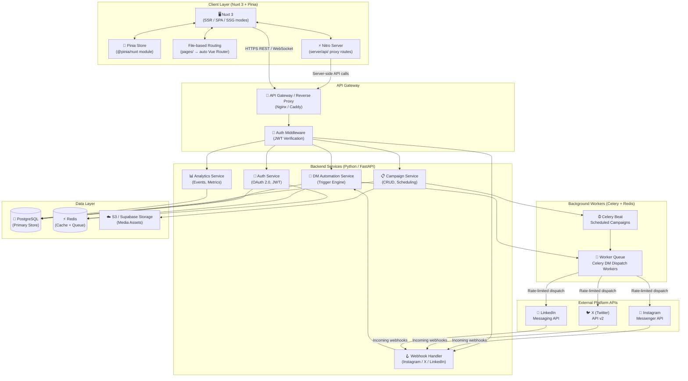
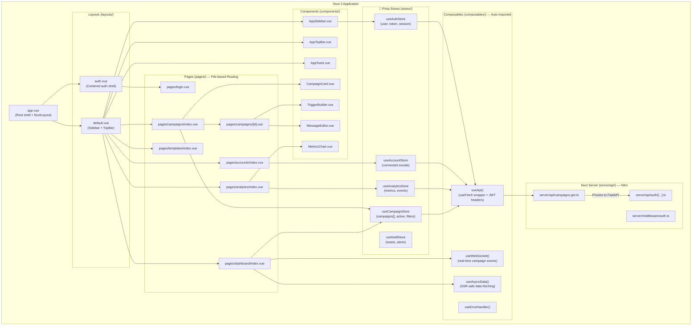
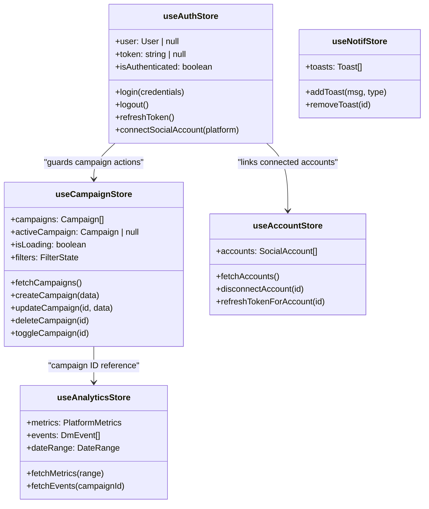
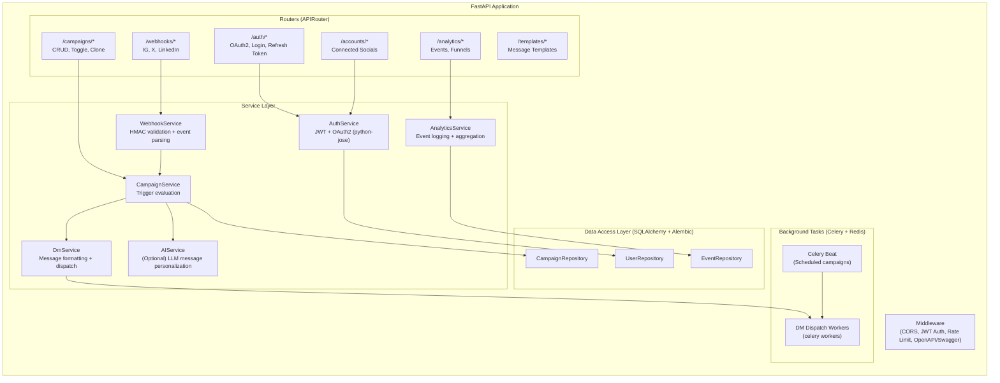
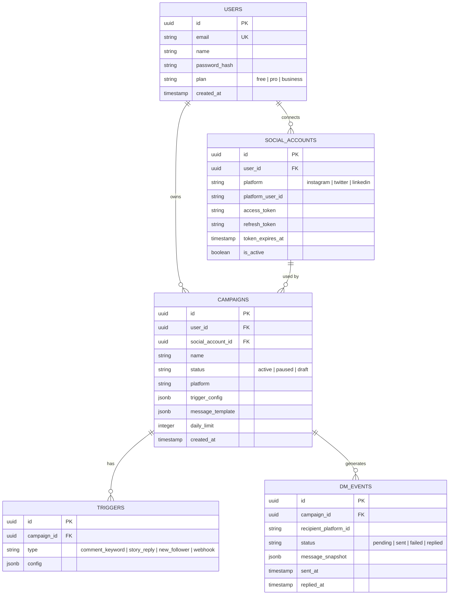
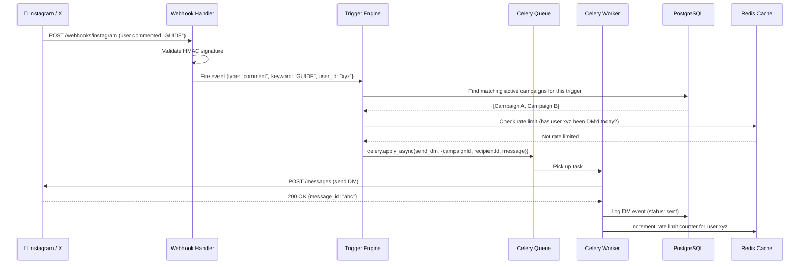

# 🤖 Auto DM Platform — Architecture & Design

> A full-stack system for automating social media direct messages, built with **Nuxt 3**, **Pinia**, and a **FastAPI (Python)** backend.

---

## 📐 System Overview



---

## 🎨 Frontend Architecture (Nuxt 3 + Pinia)



> [!NOTE]
> Nuxt 3's **`server/api/`** routes (powered by **Nitro**) act as a lightweight BFF (Backend-for-Frontend) proxy layer. They handle cookie-based auth, token injection, and CORS — so the browser never directly calls the FastAPI backend.

---

## 🗂️ Pinia Store Design



---

## 🔧 Backend Service Architecture (Python / FastAPI)



> [!NOTE]
> FastAPI auto-generates an **interactive Swagger UI** at `/docs` and a **ReDoc** page at `/redoc` — zero extra configuration needed. This makes API development and testing significantly faster.

---

## 🗄️ Database Schema (PostgreSQL)



---

## 🔄 Auto DM Trigger Flow



---

## 🥞 Recommended Tech Stack

| Layer | Technology | Why |
|---|---|---|
| **Frontend Framework** | **Nuxt 3** (Vue 3 + Nitro + Vite) | SSR/SSG/SPA in one, file-based routing, auto-imports |
| **State Management** | **Pinia** (`@pinia/nuxt` module) | Lightweight, type-safe, SSR-compatible |
| **Routing** | **File-based** (`pages/`) | Zero-config, dynamic routes `[id].vue`, layout system |
| **Data Fetching** | `useFetch` / `useAsyncData` | SSR-aware, deduped, server + client |
| **BFF Proxy Layer** | Nuxt `server/api/` (Nitro) | Hides FastAPI from browser, handles cookies/tokens |
| **UI Component Library** | **Nuxt UI** or **shadcn-vue** | Nuxt-native, accessible, dark mode ready |
| **Charts** | Chart.js + vue-chartjs | Analytics dashboards |
| **Key Nuxt Modules** | `@nuxtjs/tailwindcss`, `@nuxtjs/color-mode`, `nuxt-icon`, `@vueuse/nuxt` | Productivity + UX |
| **Build / SSR Runtime** | Vite (dev) + Nitro (prod server) | Blazing fast dev, edge-deployable prod |
| **Backend Framework** | **FastAPI (Python 3.12+)** | Async-native, auto Swagger docs, Pydantic validation |
| **Auth** | `python-jose` (JWT) + `authlib` (OAuth2) | Social OAuth flows + stateless JWT sessions |
| **Task Queue / Workers** | **Celery + Redis** | Distributed workers, rate limiting, scheduled campaigns |
| **ORM** | **SQLAlchemy 2.0** (async) + **Alembic** | Type-safe queries, auto DB migrations |
| **Data Validation** | **Pydantic v2** | Request/response models, auto docs |
| **Database** | **PostgreSQL** | Relational, robust, JSONB columns for trigger configs |
| **Cache / Rate Limiter** | Redis (`redis-py` async) | Fast lookups, counter-based rate limits |
| **AI Personalization** | OpenAI API / Ollama | Smart message generation (Python excels here) |
| **File Storage** | Supabase Storage or AWS S3 (`boto3`) | Media & template assets |
| **Real-time** | FastAPI WebSockets | Live campaign status updates to Vue frontend |
| **Infrastructure** | Docker + Railway / Render / Fly.io | Easy deployment, auto-scaling |
| **Monitoring** | Sentry SDK + `structlog` | Error tracking, structured JSON logs |

---

## 🏗️ Recommended Folder Structure

```
autodm-app/
├── frontend/                      # Nuxt 3 App
│   ├── app.vue                    # Root shell
│   ├── nuxt.config.ts             # Nuxt config (modules, runtimeConfig)
│   ├── assets/                    # Global CSS, fonts
│   ├── components/                # Auto-imported components
│   │   ├── App/
│   │   │   ├── AppSidebar.vue
│   │   │   └── AppTopBar.vue
│   │   └── Campaign/
│   │       ├── CampaignCard.vue
│   │       └── TriggerBuilder.vue
│   ├── composables/               # Auto-imported composables
│   │   ├── useApi.ts
│   │   ├── useWebSocket.ts
│   │   └── useErrorHandler.ts
│   ├── layouts/                   # Nuxt layouts
│   │   ├── default.vue
│   │   └── auth.vue
│   ├── pages/                     # File-based routes
│   │   ├── login.vue
│   │   ├── dashboard/
│   │   │   └── index.vue
│   │   ├── campaigns/
│   │   │   ├── index.vue
│   │   │   └── [id].vue
│   │   ├── analytics/index.vue
│   │   ├── accounts/index.vue
│   │   └── templates/index.vue
│   ├── server/                    # Nitro server (BFF layer)
│   │   ├── api/
│   │   │   ├── campaigns.get.ts
│   │   │   └── auth/[...].ts
│   │   └── middleware/
│   │       └── auth.ts
│   ├── stores/                    # Pinia stores
│   │   ├── auth.store.ts
│   │   ├── campaign.store.ts
│   │   ├── analytics.store.ts
│   │   └── account.store.ts
│   └── types/                     # TypeScript interfaces
│
└── backend/                       # Python FastAPI
    ├── app/
    │   ├── main.py                # FastAPI app entry point
    │   ├── config.py              # Settings (pydantic-settings)
    │   ├── dependencies.py        # DI: db sessions, current user
    │   ├── routers/               # APIRouter modules
    │   │   ├── auth.py
    │   │   ├── campaigns.py
    │   │   ├── webhooks.py
    │   │   ├── analytics.py
    │   │   └── accounts.py
    │   ├── services/              # Business logic
    │   │   ├── auth_service.py
    │   │   ├── campaign_service.py
    │   │   ├── dm_service.py
    │   │   ├── webhook_service.py
    │   │   └── ai_service.py
    │   ├── models/                # SQLAlchemy ORM models
    │   │   ├── user.py
    │   │   ├── campaign.py
    │   │   └── dm_event.py
    │   ├── schemas/               # Pydantic request/response models
    │   │   ├── campaign.py
    │   │   └── auth.py
    │   ├── repositories/          # DB query logic
    │   ├── workers/               # Celery task definitions
    │   │   ├── celery_app.py
    │   │   └── dm_tasks.py
    │   └── utils/
    ├── alembic/                   # DB migrations
    │   └── versions/
    ├── requirements.txt
    ├── .env
    └── Dockerfile
```

---

> [!TIP]
> **Start with Supabase** for PostgreSQL + Storage, and point your FastAPI backend's SQLAlchemy connection string at Supabase's Postgres instance. You get managed DB, backups, and a dashboard for free — while keeping full control of your API logic.

> [!IMPORTANT]
> Always validate **incoming webhook HMAC signatures** from platforms (Instagram, X) using Python's `hmac` module before processing events. Never trust raw webhook payloads without cryptographic verification.

---

## ⚡ Why FastAPI over Node.js for This Project

| Factor | FastAPI (Python) | Node.js/Fastify |
|---|---|---|
| **Auto API Docs** | ✅ Built-in Swagger + ReDoc | ❌ Requires manual setup |
| **Data Validation** | ✅ Pydantic v2 (runtime + type hints) | Requires Zod or Joi |
| **AI/ML Integration** | ✅ Native (LangChain, OpenAI, HuggingFace) | ❌ Awkward via HTTP calls |
| **Async Support** | ✅ First-class `async/await` | ✅ First-class |
| **Developer Speed** | ✅ Less boilerplate | Moderate |
| **Background Tasks** | Celery (battle-tested) | BullMQ (excellent) |
| **Ecosystem for Bots** | ✅ Rich (Tweepy, instagrapi, etc.) | Limited |

> **Bottom line:** FastAPI gives you the same async performance as Fastify, but with Python's superior ecosystem for social media libraries, AI personalization, and data processing — making it the ideal backbone for an Auto DM platform.
